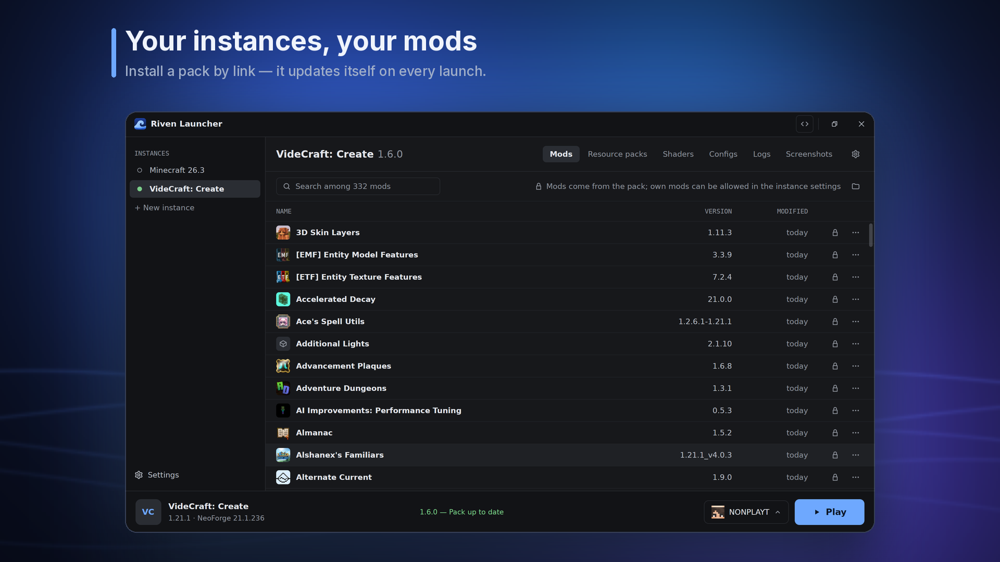
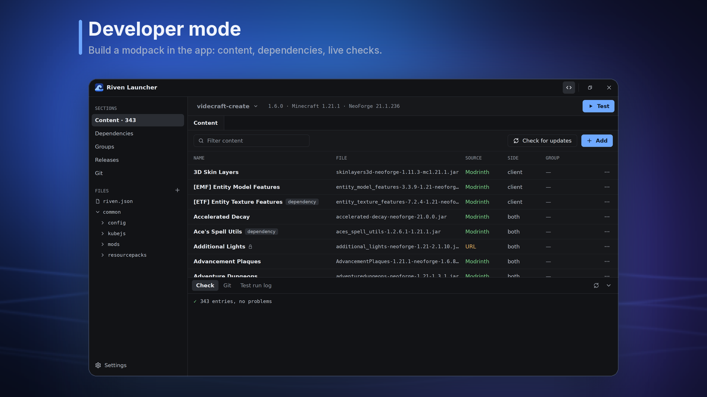
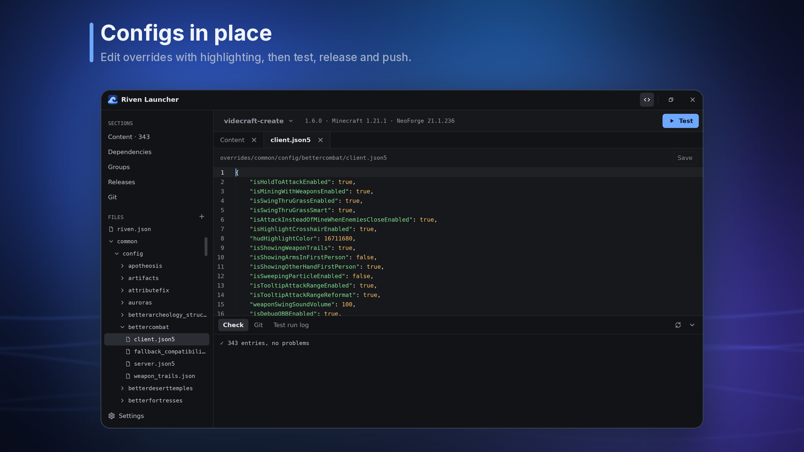

<div align="center">


# Riven

A native Minecraft launcher and modpack toolkit in pure Rust — install, update and build packs from one app or one CLI.

[](https://discord.gg/qNyybSSPm5)
[](https://github.com/BX-Team/Riven)

</div>

## 🖼️ Showcase







## ✨ Features

- **Launcher** — instances, Microsoft and offline accounts, automatic Java, Vanilla / Fabric / Quilt / NeoForge / Forge, logs and crash reports.
- **Modpacks from a link** — Modrinth modpacks, `.mrpack`, Prism exports and Riven packs; a pack updates itself before every launch.
- **Own pack format** — one `riven.json` with pinned versions and hashes, edited through the app or the CLI, never by hand.
- **Sources** — Modrinth, GitHub Releases, direct URLs and local files, with dependency resolution and conflict checks.
- **Fast, safe updates** — release channels, a tiny pointer checked with ETag, content-addressed downloads, ed25519 signatures.
- **Developer mode** — content table, dependency tree, config editor, releases, git and a test instance in one window.
- **Servers and Nix** — headless `riven install --side server`, and a Nix library that builds a pack without a fixed-output hash.

## 📦 Installation

Grab the latest build from the [Releases page](https://github.com/BX-Team/Riven/releases/latest).

### Windows (x86_64)

- **Installer:** `Riven-Setup-x86_64.exe` — installs for the current user, no admin rights needed.
- **Portable:** `riven-x86_64-windows.zip` — unzip anywhere and run `riven.exe`.

### macOS 11+ (Apple silicon and Intel)

- **Disk image:** `Riven-macos.dmg` — drag Riven Launcher to Applications. The app is not notarized: right-click → Open the first time.

### Linux (x86_64, aarch64)

- **AppImage:** `Riven-x86_64.AppImage` / `Riven-aarch64.AppImage` — works on any distribution and registers `riven://` links on first run.
- **Debian/Ubuntu:** `riven_<version>_amd64.deb` — `sudo apt install ./riven_<version>_amd64.deb`
- **Fedora/RHEL:** `riven-<version>-1.x86_64.rpm` — `sudo dnf install ./riven-<version>-1.x86_64.rpm`
- **Arch:** `riven-<version>-1-x86_64.pkg.tar.zst` — `sudo pacman -U ./riven-<version>-1-x86_64.pkg.tar.zst`

### Servers

`riven-cli-<arch>-<os>` archives hold the CLI without the GUI and its libraries:

```bash
riven install --side server --dir /srv/mc --headless gh:owner/pack
```

The launcher updates itself from GitHub Releases (Settings → About), the CLI with `riven self-update`. Copies from a package manager or Nix are updated there instead.

## ⌨️ CLI

`riven` with no arguments opens the launcher; a subcommand runs in the terminal.

```bash
riven init --mc 1.21.1 --loader neoforge   # new riven.json
riven add sodium                           # with its dependencies
riven update --dry-run                     # preview newer versions
riven build --channel stable               # signed release in dist/
riven deploy                               # dist/ → GitHub Pages
```

Every command is described in the [documentation](https://bxteam.org/docs/riven).

## ❄️ Nix

Run the launcher without installing:

```bash
nix run github:BX-Team/Riven
```

The flake exposes `packages.<system>.riven` and `riven-cli`, plus `lib.mkModpack`, which turns a pack repository into a server's mods and configs — every file is its own `fetchurl`, no `packHash`:

```nix
modpack = riven.lib.mkModpack {
  inherit pkgs;
  src = ./.;
  side = "server";
  groups.velocity = true;
};
```

## 🔨 Build from source

Riven is a single pure-Rust [gpui](https://github.com/zed-industries/zed) application. It needs the toolchain pinned in `rust-toolchain.toml`.

```bash
git clone https://github.com/BX-Team/Riven.git
cd Riven
cargo run                                        # launcher + CLI
cargo run --no-default-features --features cli   # CLI only
cargo build --release                            # target/release/riven
```

On **Linux** the launcher also needs the gpui system libraries (Wayland, X11, xkbcommon, Vulkan, fontconfig), or just `nix develop`.

## 🤝 Contributing

Ideas, bug reports and pull requests are welcome in [Issues](https://github.com/BX-Team/Riven/issues) or on [Discord](https://discord.gg/qNyybSSPm5).

## ⚖️ License

This project is licensed under the GPL-3.0-or-later License — see the [LICENSE](LICENSE) file for details.

## 💛 Credits

- [zed-industries/zed](https://github.com/zed-industries/zed): Home of the [gpui](https://www.gpui.rs/) GPU-accelerated UI framework Riven is built on.
- [longbridge/gpui-kit](https://github.com/longbridge/gpui-kit): The gpui component library under the Riven design.
- [Lighty-Launcher](https://github.com/Lighty-Launcher/LightyLauncherLib): Game, loader and Java installation and Microsoft sign-in.
- [Modrinth](https://modrinth.com): The content platform Riven searches and installs from.
- [packwiz](https://github.com/packwiz/packwiz): The modpack tool that inspired Riven's format.
